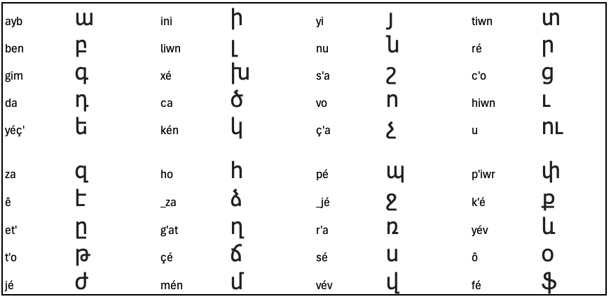

# Type on French keyboard, get Armenian text

If you don not have a French keyboard, you still might use the program, provided you can easily type é, ê, É and Ê characters.
At first, refer to the given tables to get the characters you want. After a time this will become automatic.

Try live at https://www.eludev.fr/armenian

# Programming language
The application is written with Elm, which allows for:
- easy and clean development
- very small application size
- easy communication with javascript
- simple, consistent and efficient tooling

# Rationale

Our keyboard was developed based on Eastern Armenian sounds - however Western and Eastern Armenian share the same alphabet.

Many Eastern Armenian consonants appear in 3 voicings: voiced, unvoiced unaspirated, unvoiced aspirated.

Here is how we chose to transcribe them:

|       Voiced       | Unvoiced unaspirated | Unvoiced aspirated |
| :----------------: | :------------------: | :----------------: |
| բ : b              | պ : p               | փ : p'             |
| գ : g              | կ : k                | ք : k'             |
| դ : d              | տ : t               | թ : t'             |
| ձ : _z             | ծ : c                | ց : c'             |
| ջ : _j             | ճ : ç or _c          | չ : ç' or _c'       |

We also use the ' sign (single quotation mark) for the letters ղ (g'), շ (s') and ռ (r').

For the digraph ու, just type u, and for the ligature և (yev), type év (yév at beginning of word).

Users not having ç on their keyboard may use _c instead.

Characters in our keyboard are listed according to Armenian alphabetical order:

# Unrecognized characters

Any character not recognized is rendered unmodified.

# Licence

MIT
